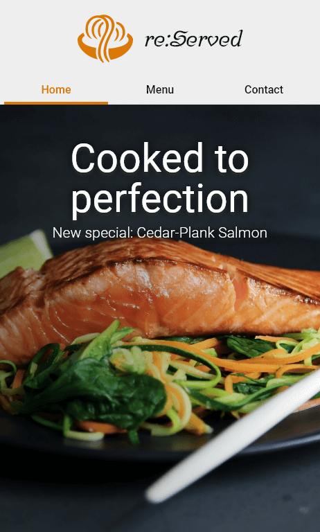
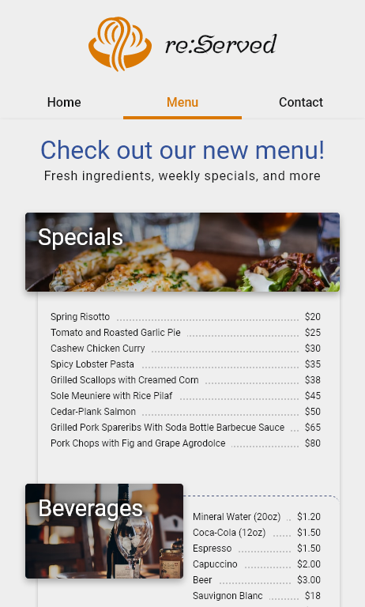

# Restaurant Page

A restaurant page, part of [The Odin Project](https://www.theodinproject.com)'s full stack curriculum. The objective of this project was to get used to the [webpack](https://webpack.js.org) workflow as well as to keep practicing DOM manipulation.

### Languages and Tools

    
    
    
    
    

### Preview

### Desktop

### Mobile

  
  

